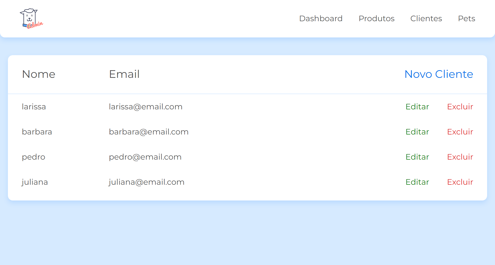

<br>
<div align="center">
<h1 id="top">PetShop Doguito - CRUD</h1>

<div>
  Aprendendo CRUD <a href="https://cursos.alura.com.br/">Alura</a>.
</div>

<p>
  <a href="#tecnologias">Tecnologias</a>&nbsp;&nbsp;&nbsp;|&nbsp;&nbsp;&nbsp;
  <a href="#projeto">Projeto</a>&nbsp;&nbsp;&nbsp;|&nbsp;&nbsp;&nbsp;
  <a href="#licenca">Licença</a>
</p>

<p>
  
</p>

<br>

<p>
  
</p>
</div>

</br>

<h2 id="tecnologias">🚀 Tecnologias</h2>

<p>Esse projeto foi desenvolvido com as seguintes tecnologias:</p>

<ul>
  <li>HTML</li>
  <li>CSS</li>
  <li>Javascript</li>
</ul>

<h2 id="projeto">💻 Projeto</h2>

<h3>Como acessar o projeto via VSCode:</h3>

Abrir a pasta petshop\_\_crud no VScode </br>

No terminal acessar:

```
cd admin/
```

Rodar o json server:

```
json-server --watch db.json
```

Abrir outro terminal e rodar o comando browser-sync

```
browser-sync start --server --file . --host --port 5000 --startPath admin/telas/lista_cliente.html
```

<h2 id="licenca">📝 Licença</h2>

<p>Esse projeto está sob a licença MIT.</p>

<h1></h1>

<p>Feito com ♥ by <a href="https://www.linkedin.com/in/barbaraishioka/">Bárbara Ishioka</a></p>

<p align="right"><a href="#top">⬆️ Voltar ao topo</a></p>
